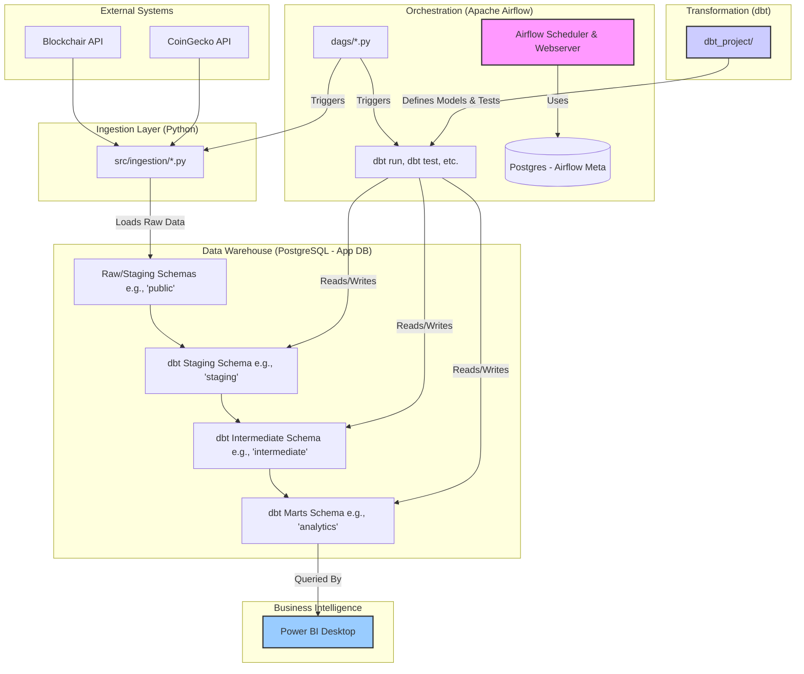

# System Architecture

This project implements an on-premise Extract, Load, Transform (ELT) pipeline designed for analyzing cryptocurrency market data and blockchain activity. The architecture prioritizes modularity, scalability within an on-premise context, and the use of open-source technologies.

## Core Components

1. **External Data Sources:**
    * **Blockchair API:** Provides detailed blockchain data including blocks, transactions, addresses, inputs, and outputs for Bitcoin (BTC), Ethereum (ETH), and Dogecoin (DOGE).
    * **CoinGecko API:** Supplies market data such as historical prices, trading volumes, and market capitalizations for the target cryptocurrencies.

2. **Data Ingestion (Python & Airflow):**
    * Custom Python scripts located in `src/ingestion/` are responsible for interacting with the external APIs.
    * These scripts handle API request logic, basic data parsing (e.g., JSON to Python dictionaries/lists), and initial data structuring.
    * Apache Airflow DAGs orchestrate the execution of these ingestion scripts, scheduling them to run periodically (e.g., daily).

3. **Apache Airflow (Orchestration Engine):**
    * Serves as the central nervous system of the ELT pipeline.
    * Manages the scheduling, execution, and monitoring of all pipeline tasks.
    * Tasks include triggering ingestion scripts, executing dbt transformations, and performing data quality checks.
    * Uses a PostgreSQL database (`postgres_airflow_meta`) for its own metadata storage.

4. **PostgreSQL (Data Warehouse):**
    * A robust open-source relational database serving as the central data repository (`postgres_app_db`).
    * **Raw/Staging Schemas (e.g., `public`, `raw_data`):** This area holds the data as it's initially loaded from the APIs by the ingestion scripts. Data here is largely unaltered, providing a record of what was received.
    * **Analytical Schemas (e.g., `staging`, `intermediate`, `analytics`, `marts`):** These schemas house the cleaned, transformed, and modeled data produced by dbt. This is where the dimensional model (facts and dimensions) resides, optimized for analytical queries.

5. **dbt (Data Build Tool):**
    * The primary tool for transforming data within the PostgreSQL data warehouse.
    * dbt projects are defined in the `dbt_project/` directory.
    * Utilizes SQL (primarily) to define data models, tests, and documentation.
    * Reads from the raw/staging schemas and writes transformed data into the analytical schemas.
    * Enforces data quality through automated testing.

6. **Power BI Desktop (Business Intelligence & Visualization):**
    * The end-user tool for data analysis and visualization.
    * Connects directly to the analytical schemas in the `postgres_app_db` (e.g., `analytics.fct_transactions`).
    * Enables the creation of interactive dashboards, reports, and ad-hoc queries based on the transformed data.

## Data Flow

The data flows through the system in the following sequence:

1. **Extract:** Airflow schedules and triggers Python ingestion scripts. These scripts call external APIs (Blockchair, CoinGecko) to fetch the latest data.
2. **Load:** The Python scripts load the raw, unprocessed data into designated tables within the `raw_data` (or `public`) schema of the `postgres_app_db`.
3. **Transform:** Airflow then triggers a sequence of dbt commands:
    * `dbt seed` (if applicable) loads static data.
    * `dbt run` executes the SQL models defined in the `dbt_project/`. This involves:
        * Cleaning and standardizing raw data into `staging` models.
        * Performing intermediate calculations or joins in `intermediate` models (if any).
        * Building the final fact and dimension tables in the `marts` (or `analytics`) schema.
    * `dbt test` runs data quality tests defined on the models to ensure accuracy and integrity.
4. **Analyze & Visualize:** Power BI connects to the `marts` schema in `postgres_app_db`, allowing users to query the transformed data and build visualizations.

## Deployment (Docker Compose)

All backend services (PostgreSQL instances, Airflow components) are containerized using Docker Compose. This approach provides:
* **Consistency:** Ensures the development, testing, and (potentially) production environments are similar.
* **Isolation:** Services run in isolated containers, preventing conflicts.
* **Ease of Setup:** Simplifies the process of getting the entire backend stack running with a single `docker-compose up` command.
* **Portability:** The setup can be easily shared and run on any machine with Docker installed.

Refer to the `docker-compose.yaml` file for the specific service definitions and configurations.

## Diagram

*(This Mermaid diagram provides a visual representation. You can generate an image from it.)*
